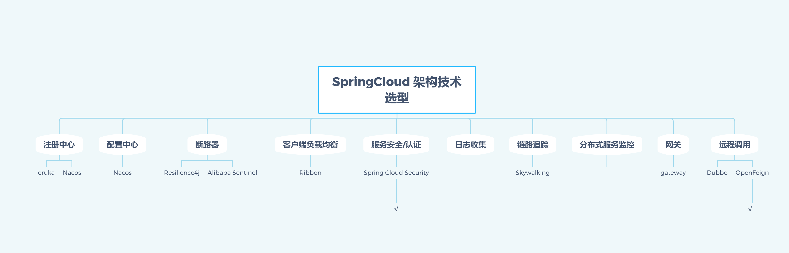

# 工程简介

    本项目是基于SpringCloud Hoxton.SR9的微服务架构，项目中使用SpringCloud Security OAuth2完成
    用户认证，用户角色权限管理，用户访问控制，用户访问日志管理，用户访问记录管理，使用Resilience4j替换原有Hystrix，使用SpringCloudGateway替换原有SpringCloud Zull2
    负载均衡采用组件为OpenFeign

# 未完成部分

* 使用Skywalking跟踪接口调用
* 使用ELK完成日志收集
* 接入ElasticSearch
* Nacos替换Eureka
* 使用Sentinel完成限流，替换Hystrix

# 延伸阅读

